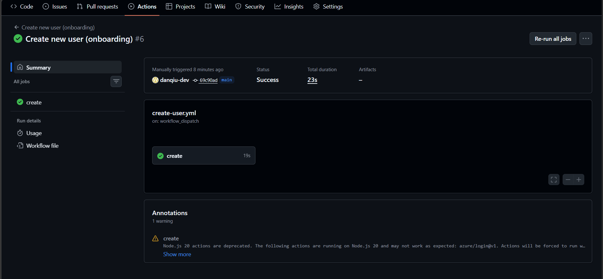

# Azure AD Automation — GitHub Actions + Entra ID

Automating common IT administration tasks using **GitHub Actions** and **Microsoft Entra ID** via the Microsoft Graph API.  
No servers. No scripts running on a VM. Just cloud-native automation triggered directly from GitHub.

---

## What this project does

This project automates four of the most common IT helpdesk tasks:

| Workflow | What it does | Trigger |
|----------|-------------|---------|
| `reset-password.yml` | Resets a user's Entra ID password and forces change on next sign-in | Manual |
| `unlock-account.yml` | Re-enables a locked/disabled Entra ID account | Manual |
| `create-user.yml` | Creates a new user in Entra ID (onboarding) | Manual |
| `disable-user.yml` | Disables account and revokes all active sessions (offboarding) | Manual |

All workflows are triggered manually via **GitHub Actions → workflow_dispatch**, meaning an admin fills in a form in the GitHub UI and clicks **Run workflow** — no code changes required.

---

## Architecture

```
Admin (GitHub UI)
       │
       ▼
GitHub Actions (workflow_dispatch form)
       │
       ▼
Azure Login (Service Principal — stored in GitHub Secrets)
       │
       ▼
Microsoft Graph API
       │
       ▼
Entra ID (user management)
```

**Key design decisions:**
- Credentials are never hardcoded — stored in GitHub Encrypted Secrets
- Service principal follows least-privilege (User Administrator role only)
- All workflow runs are logged in GitHub Actions for audit purposes
- Session revocation on offboarding ensures immediate access removal

---

## Tech stack

- **GitHub Actions** — workflow automation and CI/CD
- **Microsoft Entra ID** — cloud identity platform (formerly Azure AD)
- **Microsoft Graph API** — REST API for managing Microsoft 365 and Entra ID
- **Azure CLI** — used inside workflows to authenticate and call Graph API
- **GitHub Encrypted Secrets** — secure credential storage

---

## Prerequisites

- An Azure subscription with an Entra ID tenant
- A GitHub account and repository
- Azure CLI installed locally (for initial setup only)
- Sufficient permissions to create service principals in Entra ID

---

## Setup guide

### Step 1 — Create the service principal

> **Note:** "User Administrator" is an Entra ID role, not an Azure RBAC role, so it cannot be assigned directly via the `--role` flag. We create the service principal first, then assign the role separately.

Run this in your terminal:

```bash
az ad sp create-for-rbac \
  --name "github-ad-automation" \
  --sdk-auth
```

Copy the **entire JSON output** — you will need values from it in the next steps.

---

### Step 2 — Assign the User Administrator role

Run these commands in PowerShell:

```powershell
# Get the service principal Object ID
$SP_OBJECT_ID = az ad sp list --display-name "github-ad-automation" --query "[0].id" -o tsv

# Write the role assignment to a temp file (avoids PowerShell JSON quoting issues)
@'
{
  "roleDefinitionId": "fe930be7-5e62-47db-91af-98c3a49a38b1",
  "principalId": "YOUR-SP-OBJECT-ID",
  "directoryScopeId": "/"
}
'@ | Out-File -FilePath "$env:TEMP\role.json" -Encoding utf8

# Assign the User Administrator role
az rest --method POST `
  --url "https://graph.microsoft.com/v1.0/roleManagement/directory/roleAssignments" `
  --headers "Content-Type=application/json" `
  --body "@$env:TEMP\role.json"
```

> The `roleDefinitionId` `fe930be7-5e62-47db-91af-98c3a49a38b1` is the permanent built-in ID for User Administrator and never changes across tenants.

**Verify the role was assigned:**

Go to **Azure Portal → Entra ID → Roles and administrators → User Administrator** — you should see `github-ad-automation` listed as a member.


---

### Step 3 — Assign Contributor role on the subscription

> The service principal also needs an Azure subscription role so GitHub Actions can authenticate successfully.

```bash
az role assignment create \
  --assignee "YOUR-SP-APP-ID" \
  --role "Contributor" \
  --scope "/subscriptions/YOUR-SUBSCRIPTION-ID"
```

**Verify the role was assigned:**

Go to **Azure Portal → Subscriptions → Your subscription → Access control (IAM) → Role assignments** — you should see `github-ad-automation` with the Contributor role.

---

### Step 4 — Grant Graph API permissions (read and write)

The service principal needs explicit Microsoft Graph API permissions to read and write user data.

```powershell
# Get the App ID
$APP_ID = az ad sp list --display-name "github-ad-automation" --query "[0].appId" -o tsv

# Grant User.ReadWrite.All (read and write all users)
az ad app permission add `
  --id $APP_ID `
  --api 00000003-0000-0000-c000-000000000000 `
  --api-permissions 741f803b-c850-494e-b5df-cde7c675a1ca=Role

# Grant Directory.ReadWrite.All (read and write directory data)
az ad app permission add `
  --id $APP_ID `
  --api 00000003-0000-0000-c000-000000000000 `
  --api-permissions 19dbc75e-c2e2-444c-a770-ec69d8559fc7=Role

# Grant admin consent for both permissions
az ad app permission admin-consent --id $APP_ID
```

**Verify permissions were granted:**

Go to **Azure Portal → Entra ID → App registrations → github-ad-automation → API permissions** — you should see:

| Permission | Type | Status |
|-----------|------|--------|
| `User.ReadWrite.All` | Application | Granted |
| `Directory.ReadWrite.All` | Application | Granted |

---

### Step 5 — Find your verified domain

Every user's email must use your tenant's verified domain. Run this to find it:

```bash
az rest --method GET \
  --url "https://graph.microsoft.com/v1.0/domains" \
  --query "value[].id" -o tsv
```

It returns something like `yourtenant.onmicrosoft.com` — use this as the domain for all user emails (e.g. `apple.lee@yourtenant.onmicrosoft.com`).

---

### Step 6 — Add GitHub Secrets

In your GitHub repository go to **Settings → Secrets and Variables → Actions → New repository secret** and add these 4 secrets individually:

| Secret name | Where to find the value |
|-------------|------------------------|
| `AZURE_CLIENT_ID` | `appId` from the JSON output in Step 1 |
| `AZURE_CLIENT_SECRET` | `password` from the JSON output in Step 1 |
| `AZURE_SUBSCRIPTION_ID` | `subscriptionId` from the JSON output in Step 1 |
| `AZURE_TENANT_ID` | `tenant` from the JSON output in Step 1 |

> **Do not** wrap values in quotation marks — paste the raw value only.

---

### Step 7 — Clone and push this repo

```bash
git clone https://github.com/danqiu-dev/azure-ad-automation.git
cd azure-ad-automation
git add .
git commit -m "Initial commit — AD automation workflows"
git push
```

---

### Step 8 — Test the connection

Before running the full workflows, verify the Azure login works:

```yaml
# .github/workflows/test-login.yml
name: Test Azure login
on:
  workflow_dispatch:

jobs:
  test:
    runs-on: ubuntu-latest
    steps:
      - name: Azure login
        uses: azure/login@v1
        with:
          creds: '{"clientId":"${{ secrets.AZURE_CLIENT_ID }}","clientSecret":"${{ secrets.AZURE_CLIENT_SECRET }}","subscriptionId":"${{ secrets.AZURE_SUBSCRIPTION_ID }}","tenantId":"${{ secrets.AZURE_TENANT_ID }}"}'

      - name: Confirm login works
        run: az account show
```

Run this workflow — if it returns your subscription details, login is working. ✅

---

### Step 9 — Run a workflow

1. Go to your repository on GitHub
2. Click the **Actions** tab
3. Select a workflow (e.g. "Create new user")
4. Click **Run workflow**
5. Fill in the form fields — use your verified domain for the email
6. Click the green **Run workflow** button
7. Verify the result in **Azure Portal → Entra ID → Users**

---

## Testing & verification

Each workflow below includes exact steps to run it and verify the result in the Azure Portal.

---

### Test 1 — Create new user (onboarding)

**Run the workflow:**

1. Go to **Actions → Create new user (onboarding) → Run workflow**
2. Fill in the form:

   | Field | Test value |
   |-------|-----------|
   | Full name | `Apple Lee` |
   | Email | `apple.lee@yourtenant.onmicrosoft.com` |
   | Department | `IT` |

3. Click **Run workflow** → wait for the green checkmark ✅

**Verify in Azure Portal:**

Go to **portal.azure.com → Entra ID → Users** → search for `Apple Lee`.





---

### Test 2 — Disable user (offboarding)

**Run the workflow:**

1. Go to **Actions → Disable user (offboarding) → Run workflow**
2. Enter: `apple.lee@yourtenant.onmicrosoft.com`
3. Click **Run workflow** → wait for the green checkmark ✅

**Verify in Azure Portal:**

Go to **Entra ID → Users → Apple Lee** — account status shows **disabled**.


---

### Test 3 — Unlock account

**Run the workflow:**

1. Go to **Actions → Unlock user account → Run workflow**
2. Enter: `apple.lee@yourtenant.onmicrosoft.com`
3. Click **Run workflow** → wait for the green checkmark ✅

**Verify in Azure Portal:**

Go to **Entra ID → Users → Apple Lee** — account status shows **enabled**.


---

### Test 4 — Reset password

**Run the workflow:**

1. Go to **Actions → Reset user password → Run workflow**
2. Enter: `apple.lee@yourtenant.onmicrosoft.com`
3. Click **Run workflow** → wait for the green checkmark ✅

**Verify in Azure Portal:**

Go to **Entra ID → Users → Apple Lee → Authentication methods** — last password change timestamp reflects the current time.


---

## Workflows in detail

### Reset password (`reset-password.yml`)

**Inputs:**
- `user_email` — the UPN of the user (e.g. `john.smith@yourtenant.onmicrosoft.com`)

**What it does:**
1. Authenticates to Azure using the service principal
2. Calls Graph API `PATCH /users/{email}` to set a temporary password
3. Forces the user to change their password on next sign-in

---

### Unlock account (`unlock-account.yml`)

**Inputs:**
- `user_email` — the UPN of the user

**What it does:**
1. Authenticates to Azure
2. Calls Graph API `PATCH /users/{email}` with `accountEnabled: true`

---

### Create user — onboarding (`create-user.yml`)

**Inputs:**
- `display_name` — user's full name (e.g. `Apple Lee`)
- `email` — new UPN (e.g. `apple.lee@yourtenant.onmicrosoft.com`)
- `department` — user's department (e.g. `IT`, `Finance`, `HR`)

**What it does:**
1. Authenticates to Azure
2. Extracts the mail nickname from the email address
3. Calls Graph API `POST /users` to create a new Entra ID account
4. Sets a temporary password with forced change on first sign-in

---

### Disable user — offboarding (`disable-user.yml`)

**Inputs:**
- `user_email` — the UPN of the user to offboard

**What it does:**
1. Authenticates to Azure
2. Disables the account via `PATCH /users/{email}` with `accountEnabled: false`
3. Revokes all active sign-in sessions via `POST /users/{email}/revokeSignInSessions`

---

## Security considerations

- **No plaintext credentials** — all secrets stored in GitHub Encrypted Secrets
- **Least privilege** — service principal only has `User Administrator` role
- **Graph API permissions scoped** — only `User.ReadWrite.All` and `Directory.ReadWrite.All`
- **Audit trail** — every workflow run permanently logged in GitHub Actions
- **Session revocation** — offboarding immediately invalidates all active tokens
- **Forced password change** — all resets require user to set a new password on next sign-in

---

## Troubleshooting — issues encountered during setup and their fixes

### Issue 1 — `Role 'User Administrator' doesn't exist`
**Cause:** User Administrator is an Entra ID directory role, not an Azure RBAC role. It cannot be assigned via the `--role` flag in `az ad sp create-for-rbac`.  
**Fix:** Create the service principal without `--role`, then assign the role separately via the Graph API `roleManagement` endpoint using the built-in role ID `fe930be7-5e62-47db-91af-98c3a49a38b1`.

---

### Issue 2 — `Bad Request — Unable to read JSON request payload`
**Cause:** PowerShell mangles quotation marks when passing JSON inline in `az rest --body`.  
**Fix:** Write the JSON to a temp file using `Out-File` and pass the file path to `--body "@$env:TEMP\role.json"`.

---

### Issue 3 — `Unable to get ACTIONS_ID_TOKEN_REQUEST_URL env variable`
**Cause:** `azure/login@v2` defaults to OIDC authentication which requires additional GitHub configuration. Also triggered by accidentally running an old cached workflow version.  
**Fix:** Use `azure/login@v1` with the `creds` parameter containing individual secrets in inline JSON format. Always trigger a **fresh new run** — never use the Re-run button on old runs.

---

### Issue 4 — `No subscriptions found`
**Cause:** The service principal had no Azure subscription role — only an Entra ID role.  
**Fix:** Assign the `Contributor` role on the subscription using `az role assignment create`.

---

### Issue 5 — `The domain portion of the userPrincipalName property is invalid`
**Cause:** The email domain used for a new user did not match any verified domain in the tenant.  
**Fix:** Run `az rest --method GET --url "https://graph.microsoft.com/v1.0/domains"` to find your verified domain, then use that domain for all user emails (e.g. `apple.lee@yourtenant.onmicrosoft.com`).

---

## Future improvements

- [ ] Add email notification to user after password reset
- [ ] Add Teams notification to manager after onboarding/offboarding
- [ ] Add Terraform to provision the service principal as Infrastructure as Code
- [ ] Add Pester tests to verify each workflow completed successfully
- [ ] Add approval gate — require a second admin to approve sensitive actions
- [ ] Extend to M365 license assignment on onboarding

---

## About this project

Built as a portfolio project to demonstrate practical skills in:
- **Azure / Entra ID** — cloud identity management and Microsoft Graph API
- **GitHub Actions** — workflow automation, secrets management, and manual triggers
- **Cloud security** — service principals, least privilege, audit logging, Zero Trust principles

This project is based on real IT helpdesk tasks performed daily as an IT Service Technician, automated and moved entirely to the cloud.

---

## Author

**Dan Qiu**  
IT Service Technician → aspiring Cloud / DevOps Engineer  
[LinkedIn](https://linkedin.com/in/dan-qiu-725558209) · [GitHub](https://github.com/danqiu-dev)

---

## License

MIT — free to use, fork, and build on.
